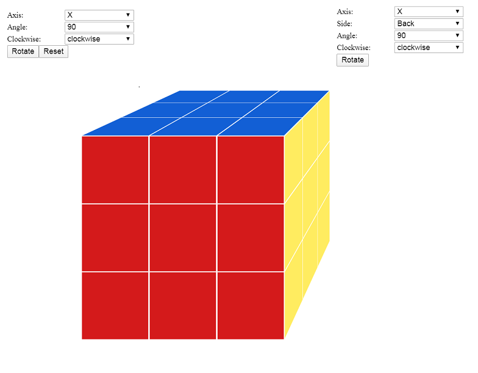

# Tutorial

The Tutorial is for the beginner for the __HTML__ and __Angular__ learner to create a cube animation without any third-party 3D libraries. Online demo link is as below. You can follow the steps to complete the learning.

## Online Demo  

[Online Demo Page](https://radalian.github.io/cube/)

## Tutorial Steps

- [Step 1: Create an new Angular Project](./tutorial/step1.md)
  - Install Node
  - Install Angular CLI
  - Create a new Angular Project
  - Launch the Angular Project

- [Step 2: Create new Angular Component For Cube](./tutorial/step2.md)
  - Create Cube Unit Component
  - Code Component Page (add html & css)

- [Step 3: Add HTML & CSS to Create Cube Faces](./tutorial/step3.md)
  - Use Flex Box Layout
  - Add 6 faces for the cube unit
  - Component Host Element
  - _CSS Perspective_

- [Step 4: Construct Cube Matrix Component](./tutorial/step4.md)
  - Create Matrix Component  
  - Load Cube Unit Component in Cub Matrix
  - Load Multiple Cube Unit Component in Cub Matrix
  - Fill The Matrix Componetn

- [Step 5: Refactor CSS (By SASS)](./tutorial/step5.md)
  - Create Common "SCSS" File
  - Refactor the Component SCSS

- [Step 6: Display Cube Matrix as Expected](./tutorial/step6.md)  
  - Component Interaction
  - Calculate Cube Position

- [Step 7: Improve The Cube Matrix Face Display](./tutorial/step7.md)
  - Reset the Face Color
  - Add Face HTML Element Reference
  - Add TS code To Update the Face Color

- [Step 8: Add Control to Rotate Cube Matrix](./tutorial/step8.md)
  - Add Rotation HTML Controls
  - Add Rotation TS Code
  - Update Cube Current Postion
    - Add Method to Calulate Coordinate
    - Add Method to Reset Position
    - Refactor the Cube Matrix Component Method

- [Step 9: Add Control to Rotate Cube Matrix Side](./tutorial/step9.md)
  - Add Side Rotation HTML Controls
  - Add HTML Control Reference
  - Add TS code To Rotate Side

- [Step 10: Use Angular Material to Improve Appearance](./tutorial/step10.md)