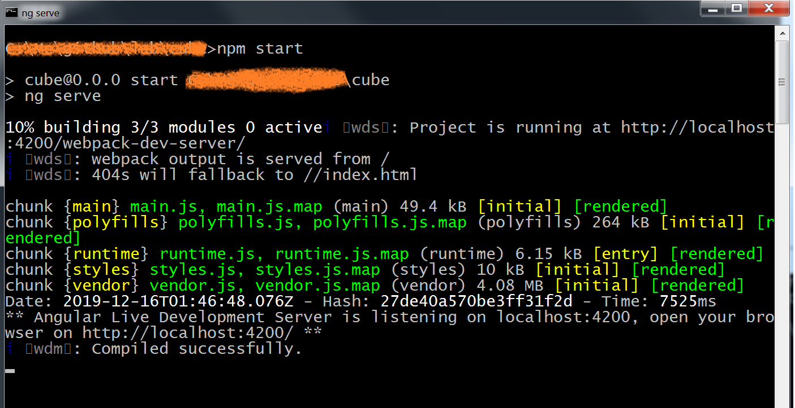

# Create a new Empty Angular Project

## Install Node
  
  > [Node Installaton](https://nodejs.org/en/)  
  > [Node Tutorial](https://www.runoob.com/nodejs/nodejs-tutorial.html)  

## Install Angular CLI  

The Angular CLI is a command-line interface tool that you use to initialize, develop, scaffold, and maintain Angular applications. You can use the tool directly in a command shell, or indirectly through an interactive UI such as Angular Console.

  > [Angular CLI Overview and Command Reference](https://angular.io/guide/setup-local)  
  > [Angular Setup](https://angular.io/guide/setup-local)

``` node
npm install -g @angular/cli
```

## Create a new Angular Project  

  input command and create new angular project.  
  _(please select the option according to the screenshot as below - add **angular routing** and **scss**)_

```node
ng new cube
```  


  > [__ng new__ Command Reference](https://angular.io/cli/new)

## Launch the Angular Project

  After the angular project creation finished, switch to the directory of the angular project(the directory contains the `angular.json` file). Input the command **`npm start`** or **`ng serve`** to launch the angular project)



  After the command execution finished, it will pop up a message to indicate the angular project is launched successfully. Input the `http://localhost:4200`, you can view the default angular project page.


