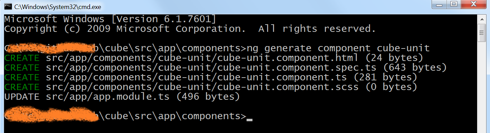
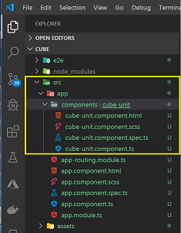

# Construct Cube Unit Component

An Angular component controls a patch of screen called a view. Individual components define and control each of the views.
To create a _cube matrix_, we need to create 27 cubes. Each cube should have the same behavior and style, so we need to abstract each cube to a new __Angular Component__. First, we should learn how to create an angular component for each cube.

> [Angular Component Introduction](https://angular.io/guide/architecture-components)
> [Angular Component Guideline](https://angular.io/guide/displaying-data)

## Create Cube Unit Component

1. Create sub folder named __components__ in the __src/app/__
2. Input [`ng generate`](https://angular.io/cli/generate) to create angular component.  

``` node
    ng generate component cube-unit
```




To create angular component by `command line` (scaffold), there are 4 files created by `Angular CLI`.  

- `component-name.component.html` is used to design for the UI display.
- `component-name.component.scss` is used for the display style.
- `component-name.component.spec.ts` is used for unit test.
- `component-name.component.ts` is used for the code logic.

After cube component creation, we consider to implement each cube GUI implement. As there are 6 faces for each cube, we should add some html in `cube-unit.component.html` and css code in `cube-unit.component.scss`.
  
## Edit Component Page

To add the faces for the cube, we need add `div` html elements. First we can creat the _front_ face for the cube. As there is common style for each face, we can separate two the _styles_ for the `scss` file.

- Add the html code below to the `cube-unit.component.html` file.

``` html
<div class="face front">1</div>
```  

- Add the css code below to the `cube-unit.component.scss` file.

``` css
.face {
  position: absolute;
  width: 100px;
  height: 100px;
  line-height: 100px;
  font-family: sans-serif;
  font-size: 60px;
  color: white;
  text-align: center;
}

.front {
  background-color: rgba(0, 0, 0, 0.3);
  transform: translateZ(50px);
}
```  

The `.face` style is for cube face common style and `.font` style is just for the cube front face.

If you don't know some css properties, please go the [help link](https://www.w3schools.com/cssref/css3_pr_transform.asp) for the css style.  

- [CSS Background Color](https://www.w3schools.com/cssref/pr_background-color.asp)
- [CSS Position](https://www.w3schools.com/cssref/pr_class_position.asp)  
- [CSS Transform](https://www.w3schools.com/cssref/css3_pr_transform.asp)  

## Display the Cube Unit Component

After changing the _cube unit component_, we would like to check the change of the component page. To make the angular project home page to display the cube unit component, we need do some change for the project.

- Remove the home page `app.component.html` html code and just leave the `<router-outlet>`  

``` html
<router-outlet></router-outlet>
```

- Add the Angular Router data to `app-routing.module.ts` file

``` ts
import { NgModule } from '@angular/core';
import { Routes, RouterModule } from '@angular/router';
import { CubeUnitComponent } from './components/cube-unit/cube-unit.component';

const routes: Routes = [
  {
    path: '**',
    component: CubeUnitComponent
  }
];

@NgModule({
  imports: [RouterModule.forRoot(routes)],
  exports: [RouterModule]
})
export class AppRoutingModule { }
```

Now you can see the Cube component page in browser
 

 [Angular Router](https://angular.io/guide/router) is a **big** learning topic. You can learn it at last for this tutorial. Currently it's enough for you to know that it provide a rule to switch to the target angular component by URL.  

 