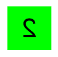
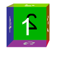
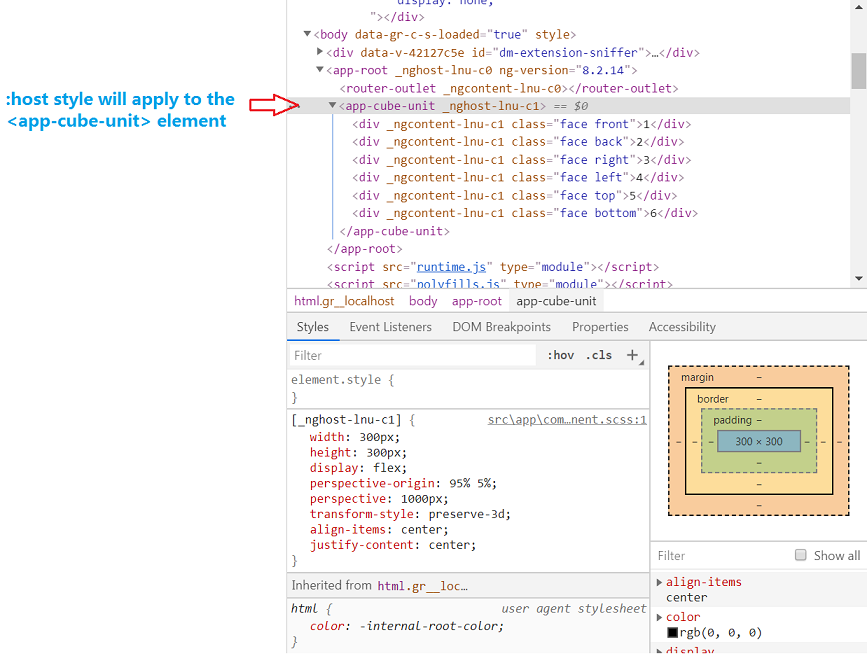

# Update Cube Unit Component From Plane to Cube

## Add 6 faces for the cube unit  

- Change the `cube-unit.component.html` html code

``` html
<div class="face front">1</div>
<div class="face back">2</div>
<div class="face right">3</div>
<div class="face left">4</div>
<div class="face top">5</div>
<div class="face bottom">6</div>
```

- Change the `cube-unit.component.scss` css code

``` css
.face {
  position: absolute;
  width: 100px;
  height: 100px;
  line-height: 100px;
  font-family: sans-serif;
  font-size: 60px;
  color: white;
  text-align: center;
}

.front {
  background-color: rgba(0, 0, 0, 0.3);
  transform: translateZ(50px);
}

.back {
  background-color: rgba(0, 255, 0, 1);
  color: black;
  transform: rotateY(180deg) translateZ(50px);
}

.right {
  background-color: rgba(196, 0, 0, 0.7);
  transform: rotateY(90deg) translateZ(50px);
}

.left {
  background-color: rgba(0, 0, 196, 0.7);
  transform: rotateY(-90deg) translateZ(50px);
}

.top {
  background-color: rgba(196, 196, 0, 0.7);
  transform: rotateX(90deg) translateZ(50px);
}

.bottom {
  background-color: rgba(196, 0, 196, 0.7);
  transform: rotateX(-90deg) translateZ(50px);
}
```

You can see the `cube component` page like:
 

To display the 3D perspective, you should add the css as below to the `cube-unit.component.scss`

``` css
:host {
    width: 300px;
    height: 300px;
    display: flex;
    align-items: center;
    justify-content: center;
    perspective-origin: 95% 5%;
    perspective: 1000px;
    transform-style: preserve-3d;
}
```  

For the `:host` style, please see more details in the chapter below.

Now the cube show like  


## Component Host Element

The `:host` CSS pseudo-class selects the shadow host of the shadow DOM containing the CSS it is used inside — in other words, this allows you to select a custom element from inside its shadow DOM.  

> [Help Link (:host CSS)](https://developer.mozilla.org/en-US/docs/Web/CSS/:host)
> [Help Link (:host -- Angular)](https://angular.io/guide/component-styles#host)  

When the cube unit component display, the angular framework will create the parent `DOM` element for the component.
  

## CSS Flex

Flex Box Layout is new added CSS property in CSS3. It makes easier to design flexible responsive layout structure without using float or positioning.
Before the Flexbox Layout module, there were four layout modes:

- Block, for sections in a webpage  
- Inline, for text
- Table, for two-dimensional table data
- Positioned, for explicit position of an element

> [Help Link: CSS Flex W3Schools](https://www.w3schools.com/css/css3_flexbox.asp)
> [Help Link: CSS Flex Layout Tutorial](https://www.runoob.com/w3cnote/flex-grammar.html)

The following style makes all child elements to which the style is applied centered horizontally and vertically

``` CSS
.box {
    display: flex;
    align-items: center;
    justify-content: center;
}
```

