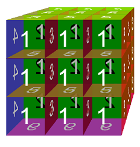
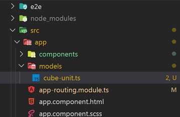
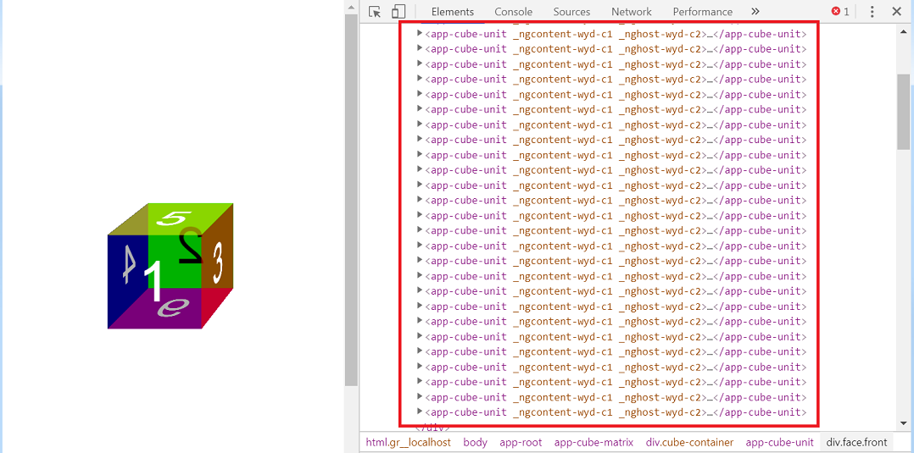

# Construct Cube Matrix Component  

Add a new component for the cube contains 27 cube units. We expect our new component display like below.


First we need to create a component named `cube-matrix` with angular CLI below the `app\components\`.

``` node
    ng generate component cube-matrix
```

## Load Cube Unit in Cub Matrix

To load the `CubeUnitComponent` in the `CubeMatrixComponent`, we need change the code of `cube-matrix.component.html`

``` html
<app-cube-unit></app-cube-unit>
```

We should change the Angular Router `app-routing.module.ts` switch the default home page from `CubeUnitComponent` to `CubeMatrixComponent`

``` ts
import { NgModule } from '@angular/core';
import { Routes, RouterModule } from '@angular/router';
import { CubeUnitComponent } from './components/cube-unit/cube-unit.component';
import { CubeMatrixComponent } from './components/cube-matrix/cube-matrix.component';

const routes: Routes = [
  {
    path: '**',
    component: CubeMatrixComponent
  }
];

@NgModule({
  imports: [RouterModule.forRoot(routes)],
  exports: [RouterModule]
})
export class AppRoutingModule { }
```

Now we can see our `CubeUnitComponent` again.

## Load Multiple Cube Unit in Cub Matrix

### Create model of for the cube unit

Add a `models` folder below the `src\app\` and create a new `cube-unit.ts` file.



Add a new `class` for the cube unit. For creating the typescript class, please go to [TypeScript Class Chapter](https://www.typescriptlang.org/docs/handbook/classes.html) to see more details.

``` ts
export class CubeUnit {

}
```

### Add Cube Matrix Properties for Cube Binding

Add the code in the `CubeMatrixComponent` for `cube-matrix.component.html` data binding.

``` ts
import { Component, OnInit } from '@angular/core';
import { CubeUnit } from '../../models/cube-unit';

@Component({
  selector: 'app-cube-matrix',
  templateUrl: './cube-matrix.component.html',
  styleUrls: ['./cube-matrix.component.scss']
})
export class CubeMatrixComponent implements OnInit {

  cubes: CubeUnit[] = [];

  constructor() {
    for (let i = 0; i < 27; i++) {
      this.cubes.push(new CubeUnit());
    }
  }

  ngOnInit() {
  }
}
```

### Change the Matrix Html Code

Add a container for the cube items and Use the [Angular NgFor directive](https://angular.io/api/common/NgForOf) to create the cubes. For the angular component template syntax, please refer to the [Link](https://angular.io/guide/template-syntax).

- Add _html_ code in `cube-matrix.component.html`:  

``` html
<app-cube-unit *ngFor="let cube of cubes; let i=index"></app-cube-unit>
```

- Add _css_ code in `cube-matrix.component.scss`:

``` css
:host {
    width: 900px;
    height: 900px;
    display: flex;
    align-items: center;
    justify-content: center;
    perspective-origin: 95% 5%;
    perspective: 1000px;
    transform-style: preserve-3d;
}

.cube-container {
    width: 300px;
    height: 300px;
    transform-style: preserve-3d;
    display: flex;
    align-items: center;
    justify-content: center;
}
```

- Refactor the `cube-unit.component.scss` file and change the `:host` style

``` css
:host {
    width: 100px;
    height: 100px;
    display: flex;
    align-items: center;
    justify-content: center;
    transform-style: preserve-3d;
    position: absolute;
}
```

> [Help Link: Angular Component Template Syntax](https://angular.io/guide/template-syntax)
> [Help Link: Angular NgFor Directive](https://angular.io/api/common/NgForOf)
> [Help Link: TypeScript Class](https://www.typescriptlang.org/docs/handbook/classes.html)

Currently, you still just see only one cube on browser. But there are 27 cubes `DOM` elements on browser. We should change the postion of each cubes and make it display as expected.


