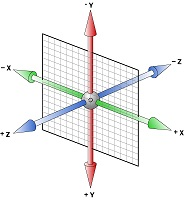
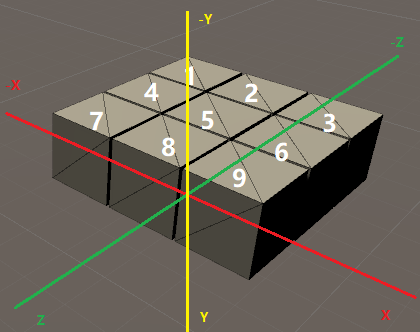
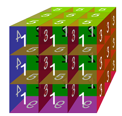

# Display Cube Matrix as Expected

To display the cube matrix as expected, we need to set each cube position once cube created. We need add the `class` __position__ to keep the cube 3D postion information.

First, we create a new file `src\app\models\cube-position.ts` and add the code  

``` ts
export class CubePosition {
    x = 0;
    y = 0;
    z = 0;

    setPosition(x: number, y: number, z: number) {
        this.x = x;
        this.y = y;
        this.z = z;
    }
}
```

The default coordinate of cube is {x: 0, y: 0, z: 0}. We should set the cube intial coordinate according to the cube index. The HTML 3d coordinate system is as below.



As there are 27 cubes for the cube matrix, we can set the first cube the coordinate `{x: -1, y: -1, z: -1}` and the second cube is `{x: 0, y: -1, z: -1}` and so on.  



After illustration, we need begin update the code of `component`

## Pass Parameter to Component

For each `cube-unit.component`, they need get the parameter `index` to update its position. So we add the `index` property and `@Input()` decorator for the property. The `index` property is set by its parent component(`cube-matrix.component`). For the `@input()` angular decorator, you can get the reference from [Link](https://angular.io/api/core/Input).

``` ts
@Component({
  selector: 'app-cube-unit',
  templateUrl: './cube-unit.component.html',
  styleUrls: ['./cube-unit.component.scss']
})
export class CubeUnitComponent implements OnInit {

  @Input() index: number;

...
```

Now, you can pass the `index` from `cube-matrix.component` to `cube-unit.component`

``` html
<div class="cube-container">
    <app-cube-unit *ngFor="let cube of cubes; let i=index" [index]="i"></app-cube-unit>
</div>

```

## Calculate Cube Position

We need calculate the cube position by passed index. We need add two properties (initial position and current position) for each cube unit position status. We should also initialize the properties in the class `constructor`.

Also, we need to inject the `host` element in the contructor which we can use to transform.

``` ts
import { Component, OnInit, ElementRef, Input } from '@angular/core';
import { CubePosition } from '../../models/cube-position';

@Component({
  selector: 'app-cube-unit',
  templateUrl: './cube-unit.component.html',
  styleUrls: ['./cube-unit.component.scss']
})
export class CubeUnitComponent implements OnInit {

  @Input() index: number;

  initPos: CubePosition; // initial position
  curPos: CubePosition;  // current position

  constructor(private hostElement: ElementRef) {
    this.initPos = new CubePosition();
    this.curPos = new CubePosition();
  }
...
```

Each Angular component, there is a lifecycle for it to create, render, destroy and so on. More information for the Angular Component Life Cycle, please refer to the [Link](https://angular.io/guide/lifecycle-hooks).

> [Angular Component Life Cycle Hooks](https://angular.io/guide/lifecycle-hooks)

For `cube-unit.component`, we can first get the passed `index` parameter in the `ngOnInit` function.

``` ts
export class CubeUnitComponent implements OnInit {

  @Input() index: number;

  initPos: CubePosition; // initial position
  curPos: CubePosition;  // current position

  constructor(private hostElement: ElementRef) {
    this.initPos = new CubePosition();
    this.curPos = new CubePosition();
  }

  ngOnInit() {
    const planeIndex = this.index % 9;
    const y = -1 + Math.floor(this.index / 9);
    const x = -1 + planeIndex % 3;
    const z = -1 + Math.floor(planeIndex / 3);
    this.initPos.setPosition(x, y, z);
    this.curPos.setPosition(x, y, z);

    this.hostElement.nativeElement.style.transform =
      `translate3d(${x * 100}px, ${y * 100}px, ${z * 100}px)`;
  }
```

Now you can find the cube display as expected.

