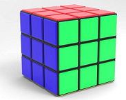
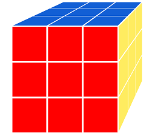

# Improve The Cube Matrix Face Display

We need to improve the cube matrix face like real __CUBE__.



We define 6 faces colors as below and set the face color according to the position.

<div style="display:flex">
    <div style="background: rgb(212, 26, 27); height: 10px; width: 10px"></div>
    <div style="background: rgb(255, 236, 96); height: 10px; width: 10px"></div>
    <div style="background: rgb(13, 194, 55); height: 10px; width: 10px"></div>
    <div style="background: rgb(18, 95, 213); height: 10px; width: 10px"></div>
    <div style="background: orange; height: 10px; width: 10px"></div>
    <div style="background: rgb(33, 33, 33); height: 10px; width: 10px"></div>
</div>

## Reset the Face Default Color

We need set each face default color to white and set the back back face not visible. We need change the `cube-unit.component.scss` code as below. We comment each face `background-color` and add the default color in the `.face` style. To make the face appearance more comfortable, we add the style `scale(0.95)` to make the face surface smaller. For the `backface-visibility` property, you can refer to [Link](https://www.runoob.com/cssref/css3-pr-backface-visibility.html) for more information.

``` css
.face {
  position: absolute;
  width: 100px;
  height: 100px;
  line-height: 100px;
  font-family: sans-serif;
  font-size: 60px;
  color: white;
  text-align: center;
  transition: transform 0.2s;
  background-color: white;
  backface-visibility:hidden;
}

.front {
  // background-color: rgba(0, 0, 0, 0.3);
  transform: translateZ(50px) scale(0.95);
}

.back {
  // background-color: rgba(0, 255, 0, 1);
  transform: rotateY(180deg) translateZ(50px) scale(0.95);;
}

.right {
  // background-color: rgba(196, 0, 0, 0.7);
  transform: rotateY(90deg) translateZ(50px) scale(0.95);;
}

.left {
  // background-color: rgba(0, 0, 196, 0.7);
  transform: rotateY(-90deg) translateZ(50px) scale(0.95);;
}

.top {
  // background-color: rgba(196, 196, 0, 0.7);
  transform: rotateX(90deg) translateZ(50px) scale(0.95);;
}

.bottom {
  // background-color: rgba(196, 0, 196, 0.7);
  transform: rotateX(-90deg) translateZ(50px) scale(0.95);;
}

```

## Add Face HTML Element Reference in The Code

If we want to change each cube face DOM element color, we need to get each cube face DOM element reference. In Angular Component, we need first declare the reference name in the `HTML` code.  

1. Change the `cube-unit.component.html` as below and remove the face number.

``` html
<div #front class="face front"></div>
<div #back class="face back"></div>
<div #right class="face right"></div>
<div #left class="face left"></div>
<div #top class="face top"></div>
<div #bottom class="face bottom"></div>
```

2. Add the Reference DOM element binding in the `cube-unit.component.ts`

``` ts
@Component({
  selector: 'app-cube-unit',
  templateUrl: './cube-unit.component.html',
  styleUrls: ['./cube-unit.component.scss']
})
export class CubeUnitComponent implements OnInit {

  @Input() index: number;
  @ViewChild('front', { static: true }) front: ElementRef<HTMLDivElement>;
  @ViewChild('back', { static: true }) back: ElementRef<HTMLDivElement>;
  @ViewChild('right', { static: true }) right: ElementRef<HTMLDivElement>;
  @ViewChild('left', { static: true }) left: ElementRef<HTMLDivElement>;
  @ViewChild('top', { static: true }) top: ElementRef<HTMLDivElement>;
  @ViewChild('bottom', { static: true }) bottom: ElementRef<HTMLDivElement>;

...
```

_You can get the more knowledge about `@ViewChild` in the chapter as below._

> [Angular Template Syntax](https://angular.io/guide/template-syntax)  
> [Angular Component Interaction Chapter](https://angular.io/guide/component-interaction#component-interaction)  
> [Angular @ViewChild Topic](https://angular.io/api/core/ViewChild)  

## Add the Method To Update the Face Color

After getting the HTML _face_ `DIV` dom element reference, we can add the `typescript` code to update the face color. Add the method and refactor the code of `cube-unit.component.ts` as below

``` ts
import { Component, OnInit, ElementRef, Input, ViewChild } from '@angular/core';
import { CubePosition } from '../../models/cube-position';

@Component({
  selector: 'app-cube-unit',
  templateUrl: './cube-unit.component.html',
  styleUrls: ['./cube-unit.component.scss']
})
export class CubeUnitComponent implements OnInit {

  @Input() index: number;
  @ViewChild('front', { static: true }) front: ElementRef<HTMLDivElement>;
  @ViewChild('back', { static: true }) back: ElementRef<HTMLDivElement>;
  @ViewChild('right', { static: true }) right: ElementRef<HTMLDivElement>;
  @ViewChild('left', { static: true }) left: ElementRef<HTMLDivElement>;
  @ViewChild('top', { static: true }) top: ElementRef<HTMLDivElement>;
  @ViewChild('bottom', { static: true }) bottom: ElementRef<HTMLDivElement>;

  initPos: CubePosition; // initial position
  curPos: CubePosition;  // current position

  constructor(private hostElement: ElementRef) {
    this.initPos = new CubePosition();
    this.curPos = new CubePosition();
  }

  ngOnInit() {
    this.initPosition();
    this.initFaces();
  }

  initPosition() {
    const planeIndex = this.index % 9;
    const y = -1 + Math.floor(this.index / 9);
    const x = -1 + planeIndex % 3;
    const z = -1 + Math.floor(planeIndex / 3);
    this.initPos.setPosition(x, y, z);
    this.curPos.setPosition(x, y, z);

    this.hostElement.nativeElement.style.transform =
      `translate3d(${x * 100}px, ${y * 100}px, ${z * 100}px)`;
  }

  initFaces() {
    if (this.initPos.x < 0) {
      this.left.nativeElement.style.backgroundColor = 'red';
    }
    if (this.initPos.x > 0) {
      this.right.nativeElement.style.backgroundColor = 'rgb(255, 236, 96)';
    }
    if (this.initPos.y > 0) {
      this.bottom.nativeElement.style.backgroundColor = 'rgb(13, 194, 55)';
    }
    if (this.initPos.y < 0) {
      this.top.nativeElement.style.backgroundColor = 'rgb(18, 95, 213)';
    }
    if (this.initPos.z < 0) {
      this.back.nativeElement.style.backgroundColor = 'orange';
    }
    if (this.initPos.z > 0) {
      this.front.nativeElement.style.backgroundColor = 'rgb(33, 33, 33)';
    }
  }
}
```

Now the cube matrix page will update as below.

