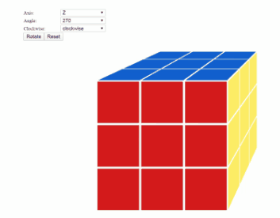

# Add Control to Rotate Cube Matrix

After the cube matrix created, it's interesting to add some control to make the cube matrix rotate. To rotate the cube, we need to determine which axis to rotate, how many angles to rotate and whehter the rotation is clockwise. We need add some controls to confirm the action for rotating the cube.  

## Add The Rotation Action Controls

We need add below HTML controls to make the cube rotate

- HTML control to select which axis to rotate
- HTML control to select how many angles to rotate
- HTML control to select which the rotation is clockwise
- HTML button to perform the rotation
- HTML button to reset the position of the cube

After thinking of UX, we add the HTML code as below in the `cube-matrix.component.html`

``` html
<div id="cube-control" class="control-panel">
    <div class="control-form">
        <label>Axis:</label>
        <select #matrixAxisSelect>
            <option selected value="x">X</option>
            <option value="y">Y</option>
            <option value="z">Z</option>
        </select>
    </div>
    <div class="control-form">
        <label>Angle:</label>
        <select #matrixAngelSelect>
            <option selected value="90">90</option>
            <option value="180">180</option>
            <option value="270">270</option>
        </select>
    </div>
    <div class="control-form">
        <label>Clockwise:</label>
        <select #matrixClockwiseSelect>
            <option selected value="true">clockwise</option>
            <option value="false">anti-clockwise</option>
        </select>
    </div>
    <div class="control-form">
        <button (click)="matrixRotateClick()">Rotate</button>
        <button (click)="matrixResetClick()">Reset</button>
    </div>
</div>
```

I want to put these controls on the upper left corner, so I set the position `absolute`. The added style code in the `cube-matrix.component.scss` is as below

``` css
#cube-control {
    position: absolute;
    left: 5px;
    top: 5px
}

.control-panel {
    align-self: flex-start;

    .control-form {
        margin: 2px;

        select {
            width: 120px;
        }

        label {
            display: inline-block;
            min-width: 100px;
            font-size: 13px;
        }
    }
}
```

Now the new added HTML controls looks like:


> [Help Link: HTML label](https://www.w3school.com.cn/tags/tag_label.asp)  
> [Help Link: HTML select](https://www.w3school.com.cn/tags/tag_select.asp)  
> [Help Link: HTML option](https://www.w3school.com.cn/tags/tag_option.asp)  
> [Help Link: Angular User Input Binding](https://angular.io/guide/user-input)  

## Add the Rotation TS Code

First, we need get the all the `select` controls reference. We need add properties in the `cube-matrix.component.ts`. Also we add the matrix reference together to perform the cube matrix rotation.

``` ts
...
  @ViewChild('matrixAxisSelect', { static: false }) matrixAxisSelect: ElementRef<HTMLSelectElement>;
  @ViewChild('matrixAngelSelect', { static: false }) matrixAngelSelect: ElementRef<HTMLSelectElement>;
  @ViewChild('matrixClockwiseSelect', { static: false }) matrixClockwiseSelect: ElementRef<HTMLSelectElement>;
  @ViewChild('matrix', { static: false }) matrix: ElementRef<HTMLDivElement>;
...
```

When user click `Rotate`, we get the `select` controls value and perform the rotation. And if click the `Reset`, we need clear the `css` `transform` data.

``` ts
...
  matrixRotateClick() {
    const axis = this.matrixAxisSelect.nativeElement.value;
    const angle = this.matrixAngelSelect.nativeElement.value;
    const clockwise = this.matrixClockwiseSelect.nativeElement.value;
    this.matrix.nativeElement.style.transform +=
      `rotate3d(${axis === 'x' ? 1 : 0}, ${axis === 'y' ? 1 : 0}, ${axis === 'z' ? 1 : 0}, ${clockwise === '0' ? '+' : '-'}${angle}deg)`;
  }

  matrixResetClick() {
    this.matrix.nativeElement.style.transform = '';
  }
...
```

## Update Cube Current Postion

If user rotate the cube matrix, all the cubes' postion are changed. We need add the algorithm to calcuate each cube current postion after rotation.

### Add Coordinate Method and Algorithm

After rotation, we will update the cube position. For the cube rotation action, there are three rotation parameter we should care - axis, angle and clockwise.  The rotation angle calculation algorithm, you can go to the [wiki](https://en.wikipedia.org/wiki/Rotation_matrix).
So we implement a method named `updateCoordinate(...)` to update the cube coordinate the the `rotatePoint(...)` for the point rotation methods.

``` ts
  updateCoordinate(axis: string, angle: number, clockwise: boolean) {
    const rotationAngle = clockwise ? -angle : angle;
    if (axis === 'x') {
      const rotated = this.rotatePoint({ x: this.curPos.z, y: this.curPos.y }, rotationAngle);
      this.curPos.z = rotated.x;
      this.curPos.y = rotated.y;
    }

    if (axis === 'y') {
      const rotated = this.rotatePoint({ x: this.curPos.x, y: this.curPos.z }, rotationAngle);
      this.curPos.x = rotated.x;
      this.curPos.z = rotated.y;
    }

    if (axis === 'z') {
      const rotated = this.rotatePoint({ x: this.curPos.y, y: this.curPos.x }, rotationAngle);
      this.curPos.y = rotated.x;
      this.curPos.x = rotated.y;
    }
  }

  rotatePoint(oriPoint: IPoint, angle: number): IPoint {
    const newPoint = { x: 0, y: 0 };
    const cosa = Math.cos(angle / 180 * Math.PI);
    const sina = Math.sin(angle / 180 * Math.PI);
    const cx = oriPoint.x;
    const cy = oriPoint.y;
    newPoint.x = Math.round(cosa * cx - sina * cy);
    newPoint.y = Math.round(sina * cx + cosa * cy);
    return newPoint;
  }
```

Besides, I create an _`IPoint`_ `interface` in new `src\app\modes\cube-point.ts` to keep the 2D point information.

``` ts
export interface IPoint {
    x: number;
    y: number;
}
```

### Add Method to Reset Position

It's easy to implement the cube reset the postion. It's just set the style `transform` by its `initPos` property

``` ts
  reset() {
    this.hostElement.nativeElement.style.transform =
      `translate3d(${this.initPos.x * 100}px, ${this.initPos.y * 100}px, ${this.initPos.z * 100}px)`;
  }
```

### Refactor the Cube Matrix Component Method

After each rotation, we need to add the coordinate update method invoke.

``` ts
  matrixRotateClick() {
    const axis = this.matrixAxisSelect.nativeElement.value;
    const angle = parseInt(this.matrixAngelSelect.nativeElement.value);
    const clockwise = this.matrixClockwiseSelect.nativeElement.value === 'true';
    this.matrix.nativeElement.style.transform +=
      `rotate3d(${axis === 'x' ? 1 : 0}, ${axis === 'y' ? 1 : 0}, ${axis === 'z' ? 1 : 0}, ${clockwise ? '+' : '-'}${angle}deg)`;
    this.cubeComponents.forEach(c => c.updateCoordinate(axis, angle, clockwise));
  }
```

Also, we need reset the postion when we perform the reset action

``` ts
  matrixResetClick() {
    this.matrix.nativeElement.style.transform = '';
    this.cubeComponents.forEach(c => c.reset());
  }
```

Now you can try the control and make the cube matrix rotate.

