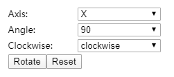

# Add Control to Rotate Cube Matrix

After the cube matrix created, it's interesting to add some control to make the cube matrix rotate. To rotate the cube, we need to determine which axis to rotate the cube, how many angles to rotate and whehter the rotation is clockwise. We need add some controls to confirm the action for rotating the cube.  

## Add The Rotation Action Controls

We need add controls to make the cube rotate

- HTML control to select which axis to rotate
- HTML control to select how many angles to rotate
- HTML control to select which the rotation is clockwise
- HTML button to perform the rotation
- HTML button to reset the position of the cube

After thinking of UX, we add the HTML code as below in the `cube-matrix.component.html`

``` html
<div class="control-panel">
    <div class="control-form">
        <label>Axis:</label>
        <select #matrixAxisSelect>
            <option selected value="x">X</option>
            <option value="y">Y</option>
            <option value="z">Z</option>
        </select>
    </div>
    <div class="control-form">
        <label>Angle:</label>
        <select #matrixAngelSelect>
            <option selected value="90">90</option>
            <option value="180">180</option>
            <option value="270">270</option>
        </select>
    </div>
    <div class="control-form">
        <label>Clockwise:</label>
        <select #matrixClockwiseSelect>
            <option selected value="0">clockwise</option>
            <option value="1">anti-clockwise</option>
        </select>
    </div>
    <div class="control-form">
        <button (click)="matrixRotateClick()">Rotate</button>
        <button (click)="matrixResetClick()">Reset</button>
    </div>
</div>

<div class="cube-container" #matrix>
    <app-cube-unit *ngFor="let cube of cubes; let i=index" [index]="i"></app-cube-unit>
</div>

```

I want to put these controls in the upper left corner, so I set the position `absolute`. The added style code in the `cube-matrix.component.scss` is as below

``` css
#cube-control {
    position: absolute;
    left: 5px;
    top: 5px
}

.control-panel {
    align-self: flex-start;

    .control-form {
        margin: 2px;

        select {
            width: 120px;
        }

        label {
            display: inline-block;
            min-width: 100px;
            font-size: 13px;
        }
    }
}
```

Now the new added HTML controls looks like:



> [Help Link: HTML label](https://www.w3school.com.cn/tags/tag_label.asp)  
> [Help Link: HTML select](https://www.w3school.com.cn/tags/tag_select.asp)  
> [Help Link: HTML option](https://www.w3school.com.cn/tags/tag_option.asp)  
> [Help Link: Angular User Input Binding](https://angular.io/guide/user-input)

## Add the Control Logic

First, we need get the all the `select` controls reference. We need add properties in the `cube-matrix.component.ts`. Also we add the matrix reference together to perform the cube matrix rotation.

``` ts
...
  @ViewChild('matrixAxisSelect', { static: false }) matrixAxisSelect: ElementRef<HTMLSelectElement>;
  @ViewChild('matrixAngelSelect', { static: false }) matrixAngelSelect: ElementRef<HTMLSelectElement>;
  @ViewChild('matrixClockwiseSelect', { static: false }) matrixClockwiseSelect: ElementRef<HTMLSelectElement>;
  @ViewChild('matrix', { static: false }) matrix: ElementRef<HTMLDivElement>;
...
```

When user click `Rotate`, we get the `select` controls value and perform the rotation. And if click the `Reset`, we need clear the `css` `transform` data.

``` ts
...
  matrixRotateClick() {
    const axis = this.matrixAxisSelect.nativeElement.value;
    const angle = this.matrixAngelSelect.nativeElement.value;
    const clockwise = this.matrixClockwiseSelect.nativeElement.value;
    this.matrix.nativeElement.style.transform +=
      `rotate3d(${axis === 'x' ? 1 : 0}, ${axis === 'y' ? 1 : 0}, ${axis === 'z' ? 1 : 0}, ${clockwise === '0' ? '+' : '-'}${angle}deg)`;
  }

    matrixResetClick() {
    this.matrix.nativeElement.style.transform = '';
  }
...
```

Now you can try the control and make the cube matrix rotate.